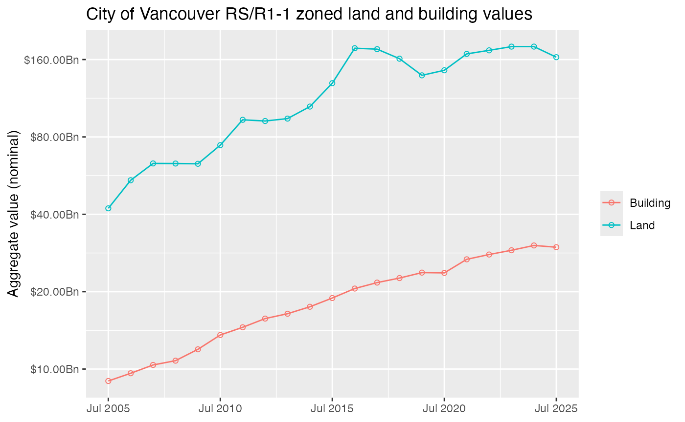
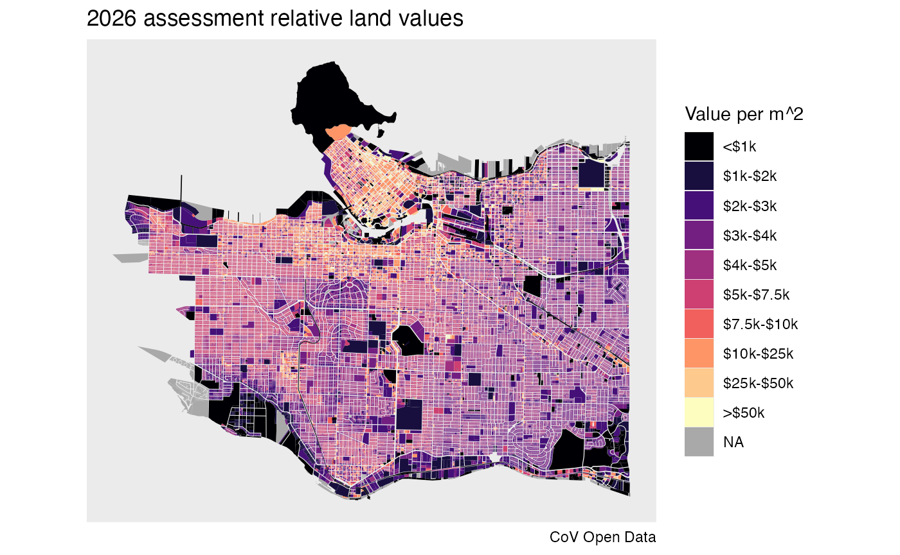

# Demo

``` r

library(VancouvR)
library(dplyr)
#> 
#> Attaching package: 'dplyr'
#> The following objects are masked from 'package:stats':
#> 
#>     filter, lag
#> The following objects are masked from 'package:base':
#> 
#>     intersect, setdiff, setequal, union
library(tidyr)
library(ggplot2)
```

### Get a list of property tax related datasets

``` r

search_cov_datasets("property-tax") |>
  select(dataset_id,title)
#> # A tibble: 4 × 2
#>   dataset_id                    title                        
#>   <chr>                         <chr>                        
#> 1 property-tax-report-2011-2015 Property tax report 2011-2015
#> 2 property-tax-report           Property tax report          
#> 3 property-tax-report-2006-2010 Property tax report 2006-2010
#> 4 property-tax-report-2016-2019 Property tax report 2016-2019
```

### Get metadata for tax report

``` r

get_cov_metadata("property-tax-report") |>
  tail(10)
#> # A tibble: 10 × 4
#>    name                       type   label                      description     
#>    <chr>                      <chr>  <chr>                      <chr>           
#>  1 current_improvement_value  int    CURRENT_IMPROVEMENT_VALUE  The market valu…
#>  2 tax_assessment_year        text   TAX_ASSESSMENT_YEAR        Year in effect …
#>  3 previous_land_value        int    PREVIOUS_LAND_VALUE        This value is f…
#>  4 previous_improvement_value int    PREVIOUS_IMPROVEMENT_VALUE This value is f…
#>  5 year_built                 text   YEAR_BUILT                 Year that the p…
#>  6 big_improvement_year       text   BIG_IMPROVEMENT_YEAR       Year of major i…
#>  7 tax_levy                   double TAX_LEVY                   This is the tot…
#>  8 neighbourhood_code         text   NEIGHBOURHOOD_CODE         This is a 3-dig…
#>  9 report_year                text   REPORT_YEAR                Year when data …
#> 10 note                       text   NOTE                       NA
```

### Get an overview of land and building values in RS zones

``` r

search_cov_datasets("property-tax") |>
  pull(dataset_id) |>
  lapply(function(ds)
    aggregate_cov_data(ds,
                       group_by="tax_assessment_year as Year",
                       where="zoning_district like 'RS-' or zoning_district like 'R1-1'",
                       select="sum(current_land_value) as Land, sum(current_improvement_value) as Building")) |> 
  bind_rows() |>
  # Records with no assessment year come back as their own group; drop them so
  # the series is purely by year.
  filter(!is.na(Year)) |>
  mutate(Date=as.Date(paste0(as.integer(Year)-1,"-07-01"))) |>
  pivot_longer(c("Land","Building")) |>
  ggplot(aes(x=Date,y=value,color=name,group=name)) +
  geom_point(shape=21) +
  geom_line() +
  scale_x_date(breaks=as.Date(paste0(seq(2005,2050,5),"-07-01")),date_labels="%b %Y") +
  scale_y_continuous(labels=function(x)scales::dollar(x, scale=10^-9,suffix="Bn"),
                     breaks=2^seq(0,10)*5*10^9,trans="log") +
  labs(title="City of Vancouver RS/R1-1 zoned land and building values",
       x=NULL, color=NULL, y="Aggregate value (nominal)")
#> Downloading data from CoV Open Data portal
#> Downloading data from CoV Open Data portal
#> Downloading data from CoV Open Data portal
#> Downloading data from CoV Open Data portal
```



### Get data for property tax report and property polygons

When metadata indicates that the data has a spatial componenet the
package will automatically return the data in `sf` format.

``` r

tax_data <- get_cov_data(dataset_id = "property-tax-report",
                         where="tax_assessment_year='2026'",
                         select = "current_land_value, land_coordinate as tax_coord")
#> Downloading data from CoV Open Data portal
property_polygons <- get_cov_data(dataset_id="property-parcel-polygons") |>
  sf::st_transform(26910)
#> Downloading data from CoV Open Data portal
```

### Compute and plot relative land values

``` r

plot_data <- property_polygons |> 
  left_join(tax_data |> group_by(tax_coord) |> summarize(current_land_value=sum(current_land_value)),by="tax_coord") |>
  mutate(rlv=current_land_value/as.numeric(sf::st_area(geometry))) |>
  mutate(rlvd=cut(rlv,breaks=c(-Inf,1000,2000,3000,4000,5000,7500,10000,25000,50000,Inf),
                  labels=c("<$1k","$1k-$2k","$2k-$3k","$3k-$4k","$4k-$5k","$5k-$7.5k","$7.5k-$10k",
                           "$10k-$25k","$25k-$50k",">$50k"),
                  ordered_result = TRUE))
ggplot(plot_data) +
  geom_sf(aes(fill=rlvd),color=NA) +
  scale_fill_viridis_d(option="magma",na.value="darkgrey") +
  labs(title="2026 assessment relative land values",fill="Value per m^2",caption="CoV Open Data") +
  coord_sf(datum=NA)
```


