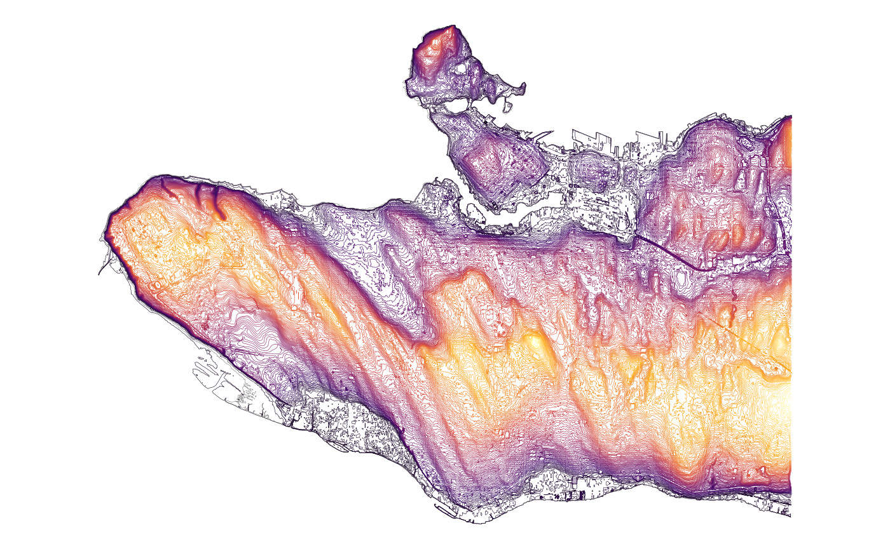

# Isolines

``` r

library(ggplot2)
library(VancouvR)
```

The City of Vancouver Open Data Portal includes an elevation contour
dataset with 1-metre contour lines covering the city. Because the
dataset has a `geo_shape` field,
[`get_cov_data()`](https://mountainmath.github.io/VancouvR/reference/get_cov_data.md)
downloads it as [FlatGeobuf](https://flatgeobuf.org) and returns an `sf`
object with its coordinate reference system already set, so it can be
passed directly to
[`geom_sf()`](https://ggplot2.tidyverse.org/reference/ggsf.html) without
any additional conversion.

``` r

contours <- get_cov_data("elevation-contour-lines-1-metre-contours")
#> Downloading data from CoV Open Data portal
class(contours)  # "sf" "data.frame"
#> [1] "sf"         "tbl_df"     "tbl"        "data.frame"
```

Mapping the contour lines coloured by elevation takes only a few lines:

``` r

ggplot(contours) +
  geom_sf(aes(color=elevation), size=0.1) +
  scale_color_viridis_c(option="inferno", guide="none") +
  theme_void()
```



The same pattern works for any spatial dataset on the portal. Use
[`get_cov_metadata()`](https://mountainmath.github.io/VancouvR/reference/get_cov_metadata.md)
to check whether a dataset has a `geo_shape` field before downloading:

``` r

get_cov_metadata("elevation-contour-lines-1-metre-contours") |>
  dplyr::filter(type == "geo_shape")
#> # A tibble: 1 × 4
#>   name  type      label description           
#>   <chr> <chr>     <chr> <chr>                 
#> 1 geom  geo_shape Geom  Spatial representation
```

To find spatial datasets in the first place, filter the catalogue on the
`geo` feature:

``` r

list_cov_datasets(refine = "features:geo") |>
  dplyr::select(dataset_id, title)
#> # A tibble: 135 × 2
#>    dataset_id                                       title                       
#>    <chr>                                            <chr>                       
#>  1 greenest-city-projects                           Greenest City projects      
#>  2 olympic-transportation-plan-pedestrian-corridors Olympic transportation plan…
#>  3 lidar-2013                                       LiDAR 2013                  
#>  4 olympic-transportation-plan-venue-closure-areas  Olympic transportation plan…
#>  5 voting-places-2011                               Voting places 2011          
#>  6 olympic-venues                                   Olympic venues              
#>  7 greenways                                        Greenways                   
#>  8 wayfinding-map-stands                            Wayfinding map stands       
#>  9 railways                                         Railways                    
#> 10 voting-places-2017                               Voting places 2017          
#> # ℹ 125 more rows
```
